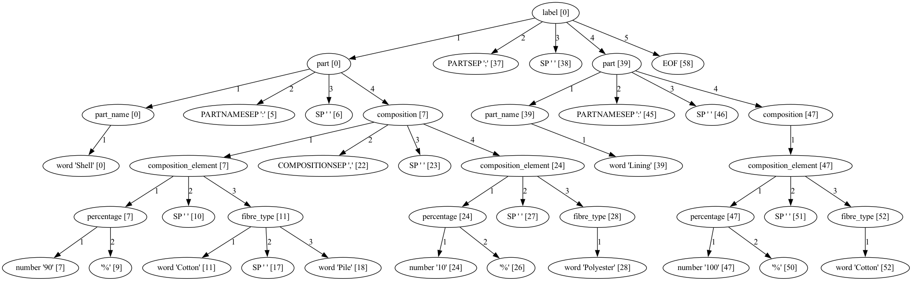

# Demonstration of using Python and Arpeggio to Parse Clothing Label Data

Arpeggio is of the (many) parser libraries available for Python.

https://textx.github.io/Arpeggio/2.0/getting_started/

I wanted to get some familiarity with some parsing tools in the Python eco-system. I decided to use the composition data on clothing label, because this is something that is semi-structured without any formal grammar. Regular expressions will only take you so far...

Disclaimer: I'm not a parsing expert, so don't take this as a useful comparison of any parsing tools or techniques.

Arpeggio was chosen because:

- Arpeggio has lots of good documentation, including tutorials.
- The errors that Arpeggio issues are reasonably good.
- Arpeggio grammars can be defined in the (canonical) Python version, or the classic PEG format, or a 'clean' PEG format. I chose to use the classic PEG format in the hope that this would be reusable to other tools (not yet evaluated)
- Arpeggio is a PEG (Parser Expression Grammar) rather than than a CFG (Context Free Grammar). PEG grammars apparently deal better with some ambiguity, which may be useful when there is no formal grammar that these clothing labels deal with.
- Arpeggio can use a PEG formalism (ie. a file format that describes the grammar). I thought it might be useful to take the same grammar and use it with a different parser (eg. Pigeon in Go)
- Arpeggio is a dynamic library solution that doesn't require a tool to build source code. I thought this would make for improved usability in places like Jupyter Notebooks.

## Parsing

I would suggest following this in the following order:

1. Start by looking at a bunch of sample inputs, working from the top-down / outside-in trying to recognise the pattern. You'll quickly notice that a label is either something simple, or it shows the composition of individual component parts.
1. Then start following the the parser grammar in `label.peg`. I'm using the classic format (not the 'clean' format); so I need to remember to use `->` and `;` in each rule.
1. Simple string-match rules (eg. terminal rules that just match `;` or `,` etc.) are by default ignored when visiting the AST and won't appear in the list of children for a node.
1. I had to explicityly return None from visit_SP because although SP matches a string terminal, it was not being ignored (either because I was using it as `SP+` etc. or because spaces are dealt with specially.)

## Recreating the label

The input labels don't conform to a particular syntax, but it would be nice to be able to take the input label, parse it, and then emit a version that is in a more normalised format.

Arpeggio provides us with an Abstract Syntax Tree (AST). Typically this would throw some data away (eg. comments, spacing, types of quotes used, etc.) Because of this, if you wanted to 'round-trip' the data (label string -> parsed -> label string), then an AST solution may not do what you want. For that, you might need to look at a Concrete Syntax Tree (CST) instead. But for our purposes, I don't believe this will be an issue.

To recreate the label I needed to effectively walk the parse-tree (AST) that the parser returned. Python's 3.10 introduces structural pattern matching (which I first encountered and loved in Erlang). I wanted to make demonstrate the use of this.

For this reason, I changed my parser visitors to return Named Tuples rather than just lists, dictionaries, strings etc. because then I communicate semantic richness rather just matching against syntax.


## Try out the code

This should work with Python 3.10 or newer

```bash
python3.11 -m venv ./venv
source ./venv/bin/activate
python -m pip install --upgrade pip wheel
pip install -r requirements.txt

python composition_namedtuples.py
```

## Find the bug!

There is a bug in the code. Given the following input:

`Shell: 90% Cotton Pile, 10% Polyester; Lining: 100% Cotton`

We don't see the Lining appearing in the resulting output.

Try this:

- Set `debug=True` to the parser creation (ParserPEG). When the parser rules, it will create two 'dot' files that will visualise its structure. If you have the `dot` tool installed (part of `graphviz`), you can render these as images and view them.
- Run a parse for the input you wish to investigate (eg. comment out all other test inputs)

```bash
dot -Tpng -O label_peg_parser_model.dot 
dot -Tpng -O label_parse_tree.dot 
```

label_parse_tree.dot.png will be instructive. I've provided you a copy if you don't have `dot` installed.



Check the following:
- Does 'Lining' appear in the AST? It should be a `part_name`.
- Does `Part(name='Lining'...` appears in the Parsed Label line?
- A `Label` should have a list of `Part`s; which visitor method should be doing this? (hint: the `Label` named tuple should model the `label` grammar rule)
- Add a debugging print statement (eg. `print(f"visit_label {children!r}")`) to the start of the visitor method that visits the `label` node to see what children it has.
- Fix that bug.
- This will cause a follow-on bug. Note that `label` is currently the only place where our grammar has an choice (`/`). When we recreate the label, we need to be mindful that we match these different choices, and that we have a case for when Label.contents is a composition or a list of parts.

## Break the parser

I shouldn't take much imagination to find inputs from the wild that would break this. Try the following:

- What happens to multiple spaces in some places?
- Can you have 0 spaces in various places?
- Put some brackets somewhere -- eg. 'Shell (cover): ...'
- Adjust the parser so it can recognise 'material xx%' or 'xx% material'
- Try more labels that use different formats.

## Exercises

- In the code `ParserPEG(label_grammar, "label", skipws=False)`, why is `skipws=False` important?
- The `label` production in label.peg mentions `EOF` to require that all that input is parsed. Imagine you wanted to make a parser just for `few_words` so you can test just that part of the parser. What would happen if you created a parser using `ParserPEG(label_grammar, "few_words", skipws=False)`? Make a new production `few_words_root` that matches a `few_words` and then EOF. Use this parser to test some of examples.
- Add the following code to the various `visit_<rule_name>` methods: `print(f"visit_<rule_name> {children!r}")`
- Set `debug=True` to the parser creation. When the parser rules, it will create two 'dot' files that will visualise its structure. If you have the `dot` tool installed (part of `graphviz`), you can render these as images and view them.

```bash
dot -Tpng -O label_peg_parser_model.dot 
dot -Tpng -O label_parse_tree.dot 
```

label_parse_tree.dot.png will be instructive.


## TODO

- Make the code more testable and refactor into a module.
- Make a better test-suite.
- Find some examples where in the input doesn't quite conform to the grammar, but should be able to.
